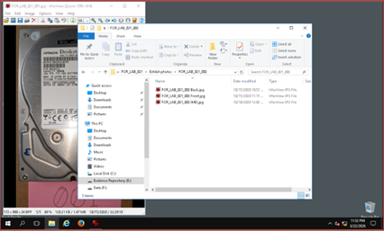
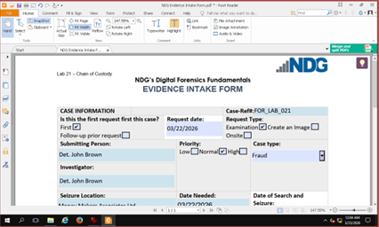
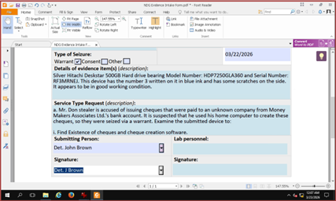
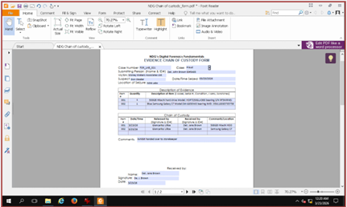
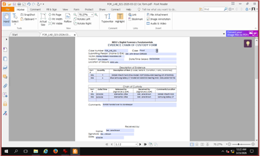

# Digital Evidence Intake and Chain of Custody Project

## Overview

This project demonstrates a digital forensics evidence handling workflow focused on evidence intake, device identification, documentation, chain of custody, and formal transfer authorization.

The project was completed in a controlled academic environment and simulates the documentation process used when physical or digital evidence is received for forensic examination. The purpose of this project is to demonstrate how evidence details are recorded, how case context is documented, and how custody of evidence is tracked to preserve integrity and accountability.

## Objective

The objective of this project was to properly document digital evidence before forensic analysis. The project focused on:

- Reviewing evidence photographs
- Identifying device information
- Recording serial numbers and device details
- Completing evidence intake documentation
- Documenting case context and preliminary observations
- Establishing a chain of custody record
- Authorizing evidence transfer for forensic examination

## Tools and Materials Used

- Evidence photographs
- Evidence intake form
- Chain of custody documentation
- Windows File Explorer
- Controlled forensic documentation environment

## Project Environment

This project was completed in a controlled environment using authorized access to evidence-related files. File Explorer was used to locate and review photographs of the evidence items. The information gathered from the images was then documented in an evidence intake form and chain of custody record.

## Evidence Handling Workflow

## 1. Evidence Review and Identification

The system was accessed using authorized credentials, and File Explorer was used to locate the directory containing the evidence photographs. The images were reviewed carefully to identify relevant information from the evidence items.

The review focused on collecting identifying details such as device information, serial numbers, and other distinguishing characteristics for the mobile phone and hard drive.

**Skill demonstrated:** Evidence review, device identification, and documentation accuracy.

---

## 2. Initial Evidence Intake Documentation

An evidence intake form was started by recording the date and relevant case information. This created a structured reference point for the investigation and ensured that all findings could be associated with the correct case.

**Skill demonstrated:** Evidence intake documentation and case organization.

---

## 3. Detailed Evidence Description and Case Context

Additional information was entered into the intake documentation, including details about the devices being examined. The hard drive and mobile phone were documented with identifying information gathered from the evidence photographs.

The purpose of the forensic analysis was also recorded, along with preliminary observations and initial findings. This helped establish context before further forensic examination.

**Skill demonstrated:** Case documentation, preliminary analysis, and evidence description.

---

## 4. Chain of Custody Documentation

The collected evidence information was formally linked to a chain of custody record. This step ensured that the evidence could be tracked throughout the investigation and that responsibility for the evidence was clearly documented.

The custody transfer documented that the evidence was transferred to Detective Jane Brown for forensic analysis. Appropriate signatures were included to support accountability and preserve the integrity of the evidence handling process.

**Skill demonstrated:** Chain of custody tracking and evidence accountability.

---

## 5. Final Review and Evidence Transfer Authorization

The final disposal authority and handling sections were reviewed to confirm that the evidence documentation was complete. The evidence was officially signed over to Detective Jane Brown, completing the documentation process and authorizing further forensic examination.

**Skill demonstrated:** Evidence transfer authorization and formal documentation review.

---

## Key Findings

- Evidence photographs were reviewed to identify device-specific information.
- The mobile phone and hard drive were documented as evidence items.
- Serial numbers and device details were collected from the available evidence images.
- An evidence intake form was completed to organize the case information.
- Preliminary observations and the purpose of the forensic analysis were documented.
- A chain of custody record was completed to track evidence handling and transfer.
- The evidence was formally transferred for forensic examination.

## Cybersecurity Relevance

Proper evidence handling is a critical part of digital forensics and incident response. In real-world investigations, analysts must ensure that evidence is documented, tracked, and transferred properly so that it remains reliable and defensible.

This project demonstrates the non-technical but essential side of cybersecurity investigations. Before forensic tools are used, evidence must be correctly identified, logged, and protected through chain of custody procedures.

## Skills Demonstrated

- Digital evidence documentation
- Evidence intake procedures
- Chain of custody tracking
- Device identification
- Serial number documentation
- Case context documentation
- Evidence transfer authorization
- Investigative recordkeeping
- Forensic documentation discipline

## Lessons Learned

This project reinforced the importance of documentation in digital forensic investigations. Even before technical analysis begins, evidence must be properly identified, described, and linked to the correct case information.

A key takeaway from this project was that chain of custody is essential for preserving evidence integrity. Every transfer of evidence should be recorded clearly, including who handled it, when it was transferred, and why the transfer occurred.

This project also highlighted that small details, such as serial numbers, device descriptions, and signatures, can be critical in supporting the reliability of an investigation.

## Disclaimer

This project was completed in a controlled academic environment for educational and portfolio purposes. Any screenshots or documents included in this repository should be sanitized to remove sensitive, personal, or case-specific information.
